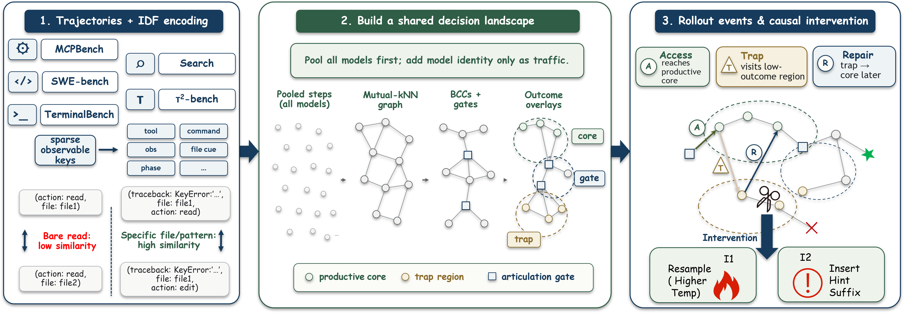

# TraceGraph: Shared Decision Landscapes for Diagnosing and Improving Agent Trajectories

<p align="center">
  <a href="https://arxiv.org/abs/2605.31308"></a>
  <a href="https://github.com/JunjieNian/TraceGraph/releases/tag/v0.1.0"></a>
  <a href="#license"></a>
</p>

<p align="center">
  <b>Junjie Nian*</b> &nbsp;&nbsp;
  <b>Kang Chen*</b> &nbsp;&nbsp;
  Ge Zhang &nbsp;&nbsp;
  Yixin Cao &nbsp;&nbsp;
  Yugang Jiang
  <br>
  Fudan University &nbsp;·&nbsp; ByteDance &nbsp;·&nbsp; Shanghai Innovation Institute
  <br>
  (* equal contribution)
</p>

<p align="center">
  <a href="https://arxiv.org/abs/2605.31308">[Paper]</a> &nbsp;|&nbsp;
  <a href="#installation">[Install]</a> &nbsp;|&nbsp;
  <a href="#usage">[Usage]</a> &nbsp;|&nbsp;
  <a href="#intervention-trap-aware-recovery">[Intervention]</a> &nbsp;|&nbsp;
  <a href="#repository-structure">[Code Map]</a>
</p>

## Pipeline

<p align="center">
  
</p>

**TraceGraph** builds a shared decision landscape from pooled multi-model agent rollouts. It turns action-observation traces into a mutual-kNN graph, discovers productive cores and trap regions through outcome-aware diffusion, and uses the resulting graph signals to diagnose and improve live SWE-bench agents.

## Why TraceGraph?

Agent benchmarks usually collapse a rich trajectory into a single scalar such as pass/fail or reward. TraceGraph keeps the **process geometry**: where agents go, which states they share, where they get trapped, and how successful runs recover.

TraceGraph provides four complementary views:

| View | Question | Output |
|------|----------|--------|
| **Shared landscape** | Which decision states are shared across models and tasks? | A mutual-kNN / BCC process atlas built without model identity |
| **Outcome overlay** | Which regions lead toward success or failure? | Diffused reward fields, productive cores, trap regions, basins, and gates |
| **Process profile** | What does each model supply, and what does each benchmark demand? | Access / Trap / Repair events with supply-demand decomposition |
| **Runtime recovery** | Can graph-derived traps improve downstream agents? | SWE-bench prefix-fork interventions with detector-guided repair notes |

## Method at a Glance

1. **Encode steps** as sparse symbolic key sets over tool use, action intent, command class, file cues, observation patterns, temporal phase, and search cues.
2. **Build shared graphs** with IDF-weighted Jaccard similarity, mutual-kNN edges, and biconnected-component decomposition.
3. **Propagate outcomes** with personalized PageRank to identify high-value cores, low-value traps, failure basins, and recovery gates.
4. **Measure behavior** through Access, Trap exposure, and Repair events, then aggregate model supply vectors and benchmark demand vectors.
5. **Intervene on SWE-bench** by triggering a trap-aware recovery note when a live agent enters a graph-derived trap state.

The released intervention runner includes a bundled MiniSWEAgent-style runtime under `tracegraph.sweagent`; no private agent framework is required. The paper experiments used plain chat-completion `THOUGHT` / `ACTION` prompting, not Harmony/native tool prompting.

---

## Repository Structure

```
tracegraph/                          # Core library
  constants.py                       #   All hyperparameters (k, sigma, alpha, ...)
  signature.py                       #   Key-set extraction + IDF-weighted Jaccard
  graph_construction.py              #   Mutual-kNN graph + BCC decomposition
  reward_field.py                    #   Reward diffusion + core/trap masks
  failure_basins.py                  #   Basin/gate/loop detection
  typed_state_mdp.py                 #   Typed-state kernels + mechanism metrics
  dataset.py                         #   Path helpers
  sweagent/                          #   Bundled MiniSWEAgent-style SWE runtime

scripts/
  pipeline/                          # Build shared landscapes
    extract_signatures.py            #   Parse -> key-sets + IDF + kNN
    build_graphs.py                  #   kNN -> mutual-kNN + BCC analysis
    compute_reward_field.py          #   Reward diffusion + core/trap overlay
    detect_failure_basins.py         #   Basin + gate + loop motif detection
    extract_typed_dynamics.py        #   Per-model metrics (committor, MFPT, ...)
    rollout_events.py                #   Access / Trap / Repair events + supply/demand

  analysis/                          # Process profile analysis
    cross_benchmark.py               #   ANOVA, rank consistency, Spearman rho
    annotation_sampling.py           #   BCC pair + articulation sampling for validation
    signature_ablation.py            #   Leave-one-key-type-out ablation
    enhanced_separability.py         #   Logistic regression + 4 capability axes
    supply_demand_decomposition.py   #   Bilinear supply x demand factorization
    counterfactual.py                #   MDP kernel interventions + matched controls
    shared_vs_permodel.py            #   Shared vs per-model graph robustness
    sensitivity.py                   #   Bootstrap CI + hyperparameter sweeps

  intervention/                      # Trap-aware recovery (RQ4)
    swe_runner.py                    #   SWE-bench prefix-fork intervention runner
    eval_patches.py                  #   SWE-bench harness evaluation
    pool_analysis.py                 #   Difference-in-differences analysis
    detector_sweep.py                #   Trigger predicate replay sweep

paper/                               # LaTeX source
```

---

## Installation

```bash
pip install -e .
```

Or install dependencies directly:

```bash
pip install -r requirements.txt
```

### Additional dependencies for intervention experiments

The intervention scripts (`scripts/intervention/`) additionally require:
- Docker (for SWE-bench environment isolation)
- A local LLM server (e.g., vLLM) or API access (DeepSeek, GLM)
- The bundled `tracegraph.sweagent` runtime; no external agent framework is required
- `datasets` for loading SWE-bench Verified metadata
- `swebench` only when evaluating patches with the official harness

See `scripts/intervention/README.md` for setup details.

---

## Data Preparation

```bash
python scripts/data/download_cxcmu.py
python scripts/data/parse_cxcmu.py
```

The parser writes `data/cxcmu/parsed/{benchmark}/{task_id}.jsonl`, the input expected by the pipeline. Set `HF_TOKEN` if HuggingFace requires gated access to the trajectory release.

---

## Usage

### Pipeline: Building Shared Landscapes

All scripts are run from the repository root. They read from `data/` and write
to `results/`.

```bash
# 1. Extract symbolic signatures + IDF + kNN arrays
python scripts/pipeline/extract_signatures.py --benchmark swebench

# 2. Build mutual-kNN graphs + BCC decomposition
python scripts/pipeline/build_graphs.py --benchmark swebench

# 3. Compute reward field (diffusion + core/trap masks)
python scripts/pipeline/compute_reward_field.py --benchmark swebench

# 4. Detect failure basins, recovery gates, loop motifs
python scripts/pipeline/detect_failure_basins.py --benchmark swebench

# 5. Extract per-model typed-state dynamics
python scripts/pipeline/extract_typed_dynamics.py --benchmark swebench

# 6. Compute rollout events + supply/demand profiles
python scripts/pipeline/rollout_events.py --benchmark swebench
```

### Analysis: Process Profiles

```bash
# Cross-benchmark analysis (ANOVA, Kendall tau, Spearman rho)
python scripts/analysis/cross_benchmark.py

# Capability axes (4 task-centered composite dimensions)
python scripts/analysis/enhanced_separability.py

# Supply x demand bilinear decomposition
python scripts/analysis/supply_demand_decomposition.py

# Counterfactual MDP stress tests
python scripts/analysis/counterfactual.py

# Bootstrap CI + hyperparameter sensitivity
python scripts/analysis/sensitivity.py
```

### Intervention: Trap-Aware Recovery

The SWE detector ships with bundled libraries in `resources/swebench_detector/`. To rebuild them from local graph artifacts, run:

```bash
python scripts/intervention/build_swe_trap_library.py
python scripts/intervention/build_swe_trap_diagnosis.py
```

```bash
# SWE-bench prefix-fork recovery (requires docker + LLM server)
python scripts/intervention/swe_runner.py \
    --design prefix-fork \
    --arms tg_baseline tg_hot tg_repair_cool \
    --instances django__django-11066 \
    --seed 11

# Evaluate patches via official SWE-bench harness
python scripts/intervention/eval_patches.py \
    --pilot-glob "results/cxcmu/intervention/*.jsonl"

# Difference-in-differences analysis
python scripts/intervention/pool_analysis.py
```

---

## Key Hyperparameters

All hyperparameters are centralized in `tracegraph/constants.py`:

| Parameter | Value | Purpose |
|-----------|-------|---------|
| `NEIGHBOR_K` | 6 | Mutual-kNN neighborhood size |
| `DIST_SCALE` (sigma) | 0.35 | RBF bandwidth for edge weights |
| `PROPAGATION_ALPHA` | 0.65 | Teleport weight in reward diffusion |
| `PROPAGATION_STEPS` | 24 | Number of diffusion iterations |
| `CORE_POS_Q` | 0.75 | Positive quantile for core mask |
| `FAILURE_BASIN_MIN_FAIL_RATE` | 0.70 | Minimum fail rate for basin seeds |
| `FAILURE_BASIN_MAX_ESCAPE_3STEP` | 0.30 | Maximum 3-step escape probability |
| `MAX_NODES` | 3000 | Node cap per task |

---

## Citation

```bibtex
@article{nian2026tracegraph,
  title   = {TraceGraph: Shared Decision Landscapes for Diagnosing
             and Improving Agent Trajectories},
  author  = {Nian, Junjie and Chen, Kang and Zhang, Ge
             and Cao, Yixin and Jiang, Yugang},
  journal = {arXiv preprint arXiv:2605.31308},
  year    = {2026},
}
```

---

## License

Apache License 2.0. See [LICENSE](LICENSE).
