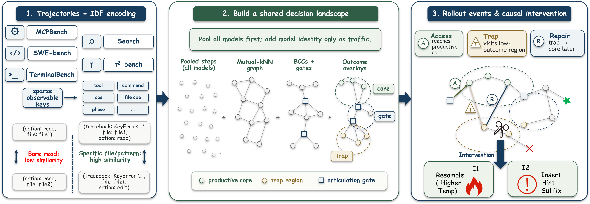

# TraceGraph: Shared Decision Landscapes for Diagnosing and Improving Agent Trajectories

<p align="center">
  <a href="https://arxiv.org/abs/2605.31308"></a>
  <a href="https://github.com/JunjieNian/TraceGraph/releases/tag/v0.1.0"></a>
  <a href="#license"></a>
</p>

<p align="center">
  <b>Junjie Nian*</b> &nbsp;&nbsp;
  <b>Kang Chen*</b> &nbsp;&nbsp;
  Ge Zhang &nbsp;&nbsp;
  Yixin Cao &nbsp;&nbsp;
  Yugang Jiang
  <br>
  Fudan University &nbsp;·&nbsp; ByteDance &nbsp;·&nbsp; Shanghai Innovation Institute
  <br>
  (* equal contribution)
</p>

<p align="center">
  <a href="https://arxiv.org/abs/2605.31308">[Paper]</a> &nbsp;|&nbsp;
  <a href="#installation">[Install]</a> &nbsp;|&nbsp;
  <a href="#usage">[Usage]</a> &nbsp;|&nbsp;
  <a href="#intervention-swe-bench-recovery">[Intervention]</a> &nbsp;|&nbsp;
  <a href="#repository-structure">[Code Map]</a>
</p>

## Pipeline

<p align="center">
  
</p>

**TraceGraph** pools multi-model agent rollouts on the same task and maps their observable action–observation steps onto one shared decision landscape. Model identity and outcomes do not affect the landscape topology; terminal outcomes are overlaid only afterwards, as historical high-outcome regions (productive cores) and low-outcome regions (traps). Three rollout events read off this landscape, Access, Trap exposure, and Repair, give model supply profiles and benchmark demand profiles. A focused SWE-bench study uses the historical trap regions as runtime triggers for lightweight recovery continuations.

## Method at a Glance

1. **Encode steps** as sparse, prefix-tagged key sets over tool name, action type, command class, observation pattern, file cues, and temporal phase, plus URL-domain, query-novelty, and evidence-count keys on the search split.
2. **Build shared landscapes** per task from pooled rollouts: IDF-weighted Jaccard similarity, mutual-kNN edges, and biconnected-component (BCC) decomposition.
3. **Overlay outcomes** after the landscape is fixed: seed each retained block with the outcomes of its visiting runs, diffuse the seeds over the block quotient graph, and take the top quartile of the positive field as cores and the bottom quartile of the negative field as traps.
4. **Read rollout events** from compact block paths, Access (reaching a core), Trap exposure (visiting a trap), and Repair (a trap visit followed later by a core visit), and aggregate them into model supply and benchmark demand.
5. **Recover on SWE-bench**: a detector matches live steps against the historical trap library and, when it fires, forks matched continuations (Baseline / Hot / Note) from the same snapshot.

---

## Repository Structure

```
tracegraph/                          # Core library
  constants.py                       #   Fixed hyperparameters
  signature.py                       #   IDF-weighted Jaccard, kNN, runtime observation keys
  graph_construction.py              #   Mutual-kNN graph + BCC decomposition
  reward_field.py                    #   Block seeds, field diffusion, core mask
  typed_state_mdp.py                 #   Typed-state kernel for the signature-ablation statistic
  dataset.py                         #   Parsed-outcome loader
  sweagent/                          #   Bundled MiniSWEAgent-style SWE runtime

scripts/
  data/                              # Source data
    download_cxcmu.py                #   Download the cx-cmu trajectory release
    parse_cxcmu.py                   #   Parse records into per-task step sequences

  pipeline/                          # Build shared landscapes
    extract_signatures.py            #   Parse -> key sets + IDF + kNN
    build_graphs.py                  #   kNN -> mutual-kNN + BCC analysis
    compute_reward_field.py          #   Outcome diffusion + core mask
    rollout_events.py                #   Access / Trap / Repair events + supply/demand

  analysis/                          # Validation and robustness
    annotation_sampling.py           #   BCC-pair + articulation samples for annotation
    signature_ablation.py            #   Seven signature conditions, model separation
    shared_vs_permodel.py            #   Pooled vs per-model graph size
    sensitivity.py                   #   Bootstrap CIs + core/trap quantile sweeps

  intervention/                      # SWE-bench recovery
    build_swe_trap_library.py        #   Trap / reference libraries + IDF corpus
    build_swe_trap_diagnosis.py      #   Six-family diagnosis sidecar for the Note arm
    swe_runner.py                    #   Prefix-fork runner (Baseline / Hot / Note)
    eval_patches.py                  #   Official SWE-bench harness evaluation

resources/swebench_detector/         # Bundled detector libraries
paper/                               # arXiv LaTeX source and figures
```

---

## Installation

```bash
pip install -e .
```

Or install dependencies directly:

```bash
pip install -r requirements.txt
```

### Additional dependencies for intervention experiments

The intervention scripts (`scripts/intervention/`) additionally require:
- Docker and the SWE-bench Verified instance images
- A local OpenAI-compatible LLM server (e.g., vLLM) or provider API access (DeepSeek, GLM)
- `openai` and `datasets` (`pip install -e ".[intervention]"`)
- `swebench` when evaluating patches with the official harness

The bundled `tracegraph.sweagent` runtime is the agent used in the experiments; no external agent framework is required. See `scripts/intervention/README.md` for details.

---

## Data Preparation

```bash
python scripts/data/download_cxcmu.py
python scripts/data/parse_cxcmu.py
```

The release is gated on Hugging Face; set `HF_TOKEN` after requesting access. The parser writes `data/cxcmu/parsed/{benchmark}/{task_id}.jsonl`, the input expected by the pipeline. Raw trajectories are not redistributed with this code.

---

## Usage

All scripts are run from the repository root. They read from `data/` and write
to `results/`.

### Pipeline: Building Shared Landscapes

```bash
# 1. Extract symbolic signatures + IDF + kNN arrays
python scripts/pipeline/extract_signatures.py --benchmark swebench

# 2. Build mutual-kNN graphs + BCC decomposition
python scripts/pipeline/build_graphs.py --benchmark swebench

# 3. Overlay outcomes (diffused field + core mask)
python scripts/pipeline/compute_reward_field.py --benchmark swebench

# 4. Compute rollout events + supply/demand profiles
python scripts/pipeline/rollout_events.py
```

Omit `--benchmark` to process all five splits; `bash scripts/run_pipeline.sh` runs the same stages followed by the sensitivity analysis.

### Analysis

```bash
# Blinded samples for the BCC-pair and articulation annotation checks
python scripts/analysis/annotation_sampling.py

# Signature ablation (30 tasks per split = 150 tasks)
python scripts/analysis/signature_ablation.py

# Pooled vs per-model graph size
python scripts/analysis/shared_vs_permodel.py

# Bootstrap CIs for supply and demand + core/trap quantile sweeps
python scripts/analysis/sensitivity.py
```

### Intervention: SWE-bench Recovery

The detector libraries ship in `resources/swebench_detector/`. To rebuild them from local graph artifacts:

```bash
python scripts/intervention/build_swe_trap_library.py
python scripts/intervention/build_swe_trap_diagnosis.py
```

Run the prefix-fork study; all detector and decoding defaults match the paper:

```bash
python scripts/intervention/swe_runner.py \
    --api-provider vllm \
    --model-base-url http://localhost:8000/v1 \
    --model-name <served-model-name> \
    --output results/cxcmu/intervention/swe_prefix_fork.jsonl

python scripts/intervention/eval_patches.py \
    --rollout-glob "results/cxcmu/intervention/swe_prefix_fork.jsonl"
```

### Reproduction notes

Three details decide whether a rerun matches the published tables.

**MCPBench uses a reward-weighted seed.** MCPBench records a continuous
multi-criteria score, so the reward-weighted analogue is used consistently
for it: the block seed averages the per-task max-normalised reward of the
visiting runs, and the demand contrast is reward-weighted. Splits listed in
`CONTINUOUS_REWARD_BENCHMARKS` take this path automatically in
`compute_reward_field.py`.

**The recovery detector fires on similarity plus local gates.** A trigger
requires the trap-similarity threshold together with the warmup, cooldown,
edit/submit intent, and file-cue gates. The trap-versus-reference margin is
recorded per step for bookkeeping and does not gate firing. Exception-shaped
observation keys match on any observation text, including source code the
agent has read, not only runtime tracebacks.

**Neighbour ties are not bit-reproducible across NumPy versions.** Signature
key sets rebuild byte-identically, but `argpartition` orders equidistant
neighbours differently across versions. Sorted per-row distances are
unchanged; the residual noise on demand cells is about `±0.015`.

---

## Key Hyperparameters

Graph and overlay hyperparameters are fixed across splits in `tracegraph/constants.py`:

| Parameter | Value | Purpose |
|-----------|-------|---------|
| `NEIGHBOR_K` | 6 | Mutual-kNN neighbourhood size |
| `PROPAGATION_ALPHA` | 0.65 | Seed weight α in the diffusion update f ← α·s + (1−α)·P·f |
| `PROPAGATION_STEPS` | 24 | Number of diffusion iterations |
| `SUPPORT_SHRINK_EXP` | 0.5 | Support-shrinkage exponent of the block seed |
| `MIN_RUN_SUPPORT` | 3 | Minimum visiting runs for a block to receive a seed |
| `CORE_POS_Q` | 0.75 | Core mask: quantile of the positive field |
| `TRAP_QUANTILE` | 0.25 | Trap mask: quantile of the negative field (`rollout_events.py`) |
| `MAX_NODES` | 3000 | Node cap per task graph |

Detector and continuation defaults of `scripts/intervention/swe_runner.py`:

| Setting | Value |
|---------|-------|
| Trap similarity threshold | 0.35 |
| Trap–reference margin (bookkeeping only) | 0.03 |
| Warmup / cooldown steps | 2 / 4 |
| Max triggers per rollout | 1 |
| Allowed intents | edit, submit |
| Observation-key gate | none |
| File-locality gate | require a `FILE_PATH:*` cue |
| Step budget | 30 total steps per arm |
| Temperature | 0.6 (Hot arm: 0.9), top-p 0.95 |

---

## Citation

```bibtex
@article{nian2026tracegraph,
  title   = {TraceGraph: Shared Decision Landscapes for Diagnosing
             and Improving Agent Trajectories},
  author  = {Nian, Junjie and Chen, Kang and Zhang, Ge
             and Cao, Yixin and Jiang, Yugang},
  journal = {arXiv preprint arXiv:2605.31308},
  year    = {2026},
}
```

---

## License

Apache License 2.0. See [LICENSE](LICENSE).
